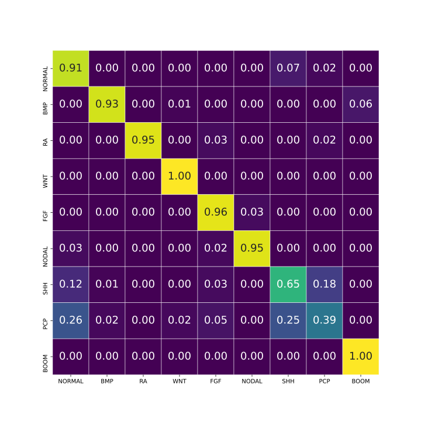

This file presents our model zoo.

We have two models trained:

<ul>
<li>  <a href="https://drive.google.com/file/d/1g-mZ-ZwG8C_Z7CLziJRyUcb-VhCF_VA_/view?usp=sharing"><b>EmbryoNet_original_batch_8</b></a>. Original model, trained on dataset using human perception.
 

<li> <a href="https://drive.google.com/file/d/1XCGFotNh6grInEf7CptsRFHGR0TNq3AD/view?usp=sharing"><b>EmbryoNet_prime_batch_8</b></a>. Model trained on dataset, where embryo phenotype detection was shifted towards experiment start by 120 minutes.
</ul>

## Confusion matrices

<table>
   <tr>
    <td><a href="https://drive.google.com/file/d/1g-mZ-ZwG8C_Z7CLziJRyUcb-VhCF_VA_/view?usp=sharing"><b>EmbryoNet_original_batch_8</b></a>   </td>
    <td></td>
   </tr> 
   <tr>
      <td><a href="https://drive.google.com/file/d/1XCGFotNh6grInEf7CptsRFHGR0TNq3AD/view?usp=sharing"><b>EmbryoNet_prime_batch_8</b></a> </td>
      <td></td>
  </tr>
</table> 

## Table metrics            

|  <a href="https://drive.google.com/file/d/1g-mZ-ZwG8C_Z7CLziJRyUcb-VhCF_VA_/view?usp=sharing"><b>EmbryoNet_original_batch_8</b></a>      |precision| recall | f1-score| 
|:-------|:-------|:--------|:--------|
| NORMAL | 0.72   | 0.87    | 0.79  | 
| BMP    | 0.97   | 0.86    | 0.91  | 
| RA     | 0.97   | 0.87    | 0.92  | 
| WNT    | 0.97   | 0.95    | 0.96  | 
| FGF    | 0.77   | 0.85    | 0.81  |
| NODAL  | 0.98   | 0.77    | 0.86  |
| SHH    | 0.79   | 0.65    | 0.71  |
| PCP    | 0.67   | 0.45    | 0.54  |
| BOOM   | 0.96   | 0.99    | 0.98  |    

  
             
|  <a href="https://drive.google.com/file/d/1XCGFotNh6grInEf7CptsRFHGR0TNq3AD/view?usp=sharing"><b>EmbryoNet_prime_batch_8</b> |precision| recall | f1-score| 
|:-------|:-------|:--------|:------|
| NORMAL | 0.69   | 0.81    | 0.71  | 
| BMP    | 0.95   | 0.76    | 0.84  | 
| RA     | 0.93   | 0.89    | 0.91  | 
| WNT    | 0.96   | 0.91    | 0.94  | 
| FGF    | 0.80   | 0.84    | 0.82  |
| NODAL  | 0.98   | 0.90    | 0.9.  |
| SHH    | 0.58   | 0.64    | 0.61  |
| PCP    | 0.53   | 0.29    | 0.38  |
| BOOM   | 0.92   | 1.00    | 0.96  |        
