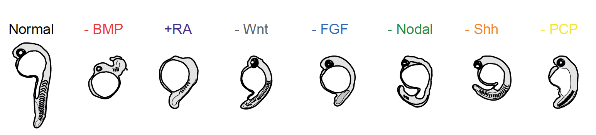
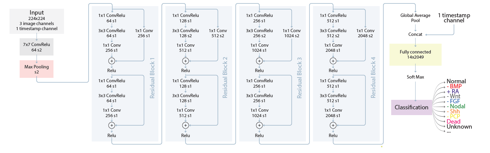
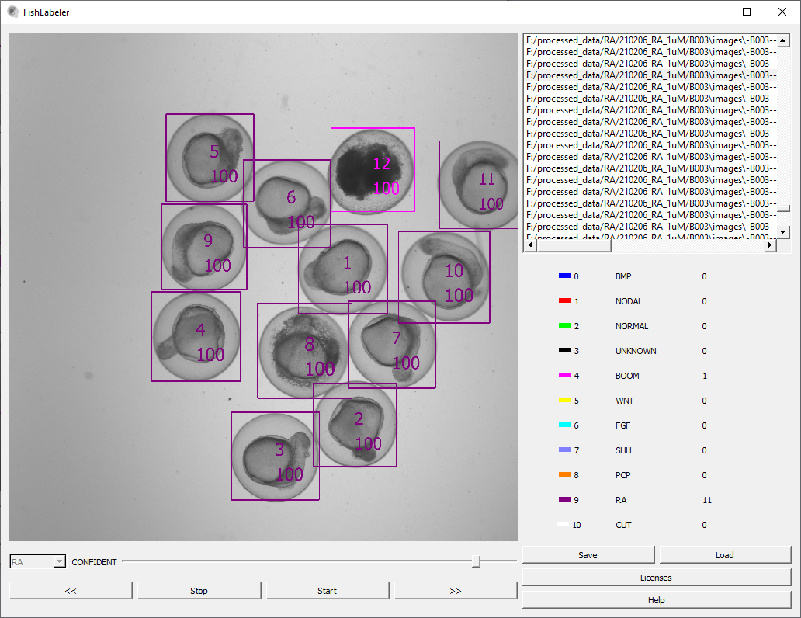
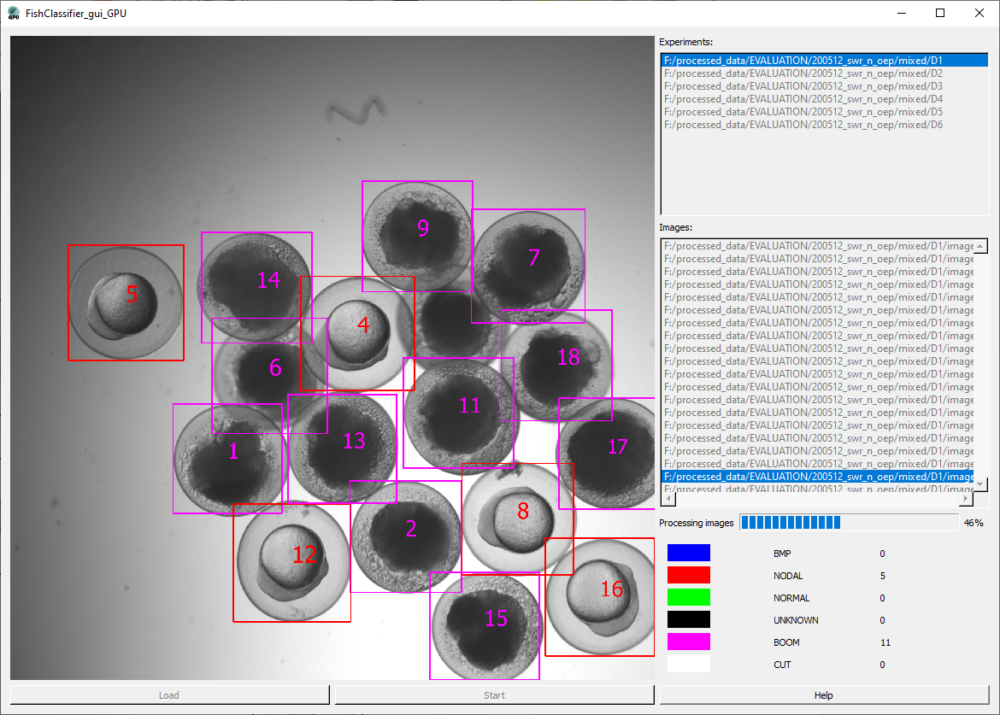
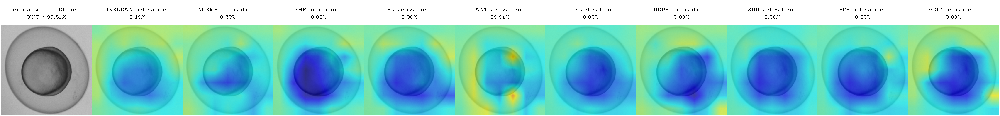

# EmbryoNet

## Introduction

This repository provides supplementary implementation materials to our paper "EmbryoNet: Using deep learning to link embryonic phenotypes to signaling pathways". 

During zebrafish development, seven major signaling pathways orchestrate the formation of the body plan: BMP, RA, Wnt, FGF and Nodal pattern the germ layers and regulate the formation of the orthogonal anterior-posterior and dorsal-ventral axes, whereas the elongation and morphogenesis of the body axis and later tissues is additionally shaped by the activity of Shh and PCP signaling.

EmbryoNet is a convolutional neural network, used in a pipeline that allows the automatic image classification of signaling-associated phenotypic changes. Derived from ResNet-18, EmbryoNet incorporates visual information and temporal data for the classification of phenotypes and can properly handle heterochronic effects. 

The EmbryoNet classification pipeline is accurate, lightweight and easy to deploy.
This repository contains sources implementing EmbryoNet training and export code, together with additional C++ tools for data set labeling and inference.
The materials are organized in folders <a href="https://github.com/hagorms/EmbryoNet/tree/main/GUI">GUI</a> and <a href="https://github.com/hagorms/EmbryoNet/tree/main/Train_Eval">Train_Eval</a> .

## <a href="https://github.com/mueller-lab/EmbryoNet/tree/main/GUI"><b>GUI</b></a> 

The GUI folder contains C++ tools to label and visualize data sets and to run EmbryoNet inference. 

There are two tools implemented with graphical user interface: 

* FishLabeler  - tool to visualize and manually label predetected embryos.  

&nbsp;&nbsp;&nbsp;&nbsp;&nbsp;&nbsp;   

* FishClassifier  - tool to detect embryos and run the EmbryoNet inference pipeline.

&nbsp;&nbsp;&nbsp;&nbsp;&nbsp;&nbsp;   

To compile the GUI, please follow the <a href="https://github.com/mueller-lab/EmbryoNet/tree/main/GUI"><b>instructions and tutorial</b></a>.

## <a href="https://github.com/mueller-lab/EmbryoNet/tree/main/Train_Eval"><b>Network Training  and Evaluation tools</b></a>

The Train_Eval folder contains python tools to train EmbryoNet and analyze inference results.
Folders with packages and tools to work with EmbryoNet database model converting, running analysis, training, etc:

* TrainEval/tools/Datasets: tools to work with data sets
* TrainEval/tools/Export: tools to export a trained model and to create ExperimentRunner configs
* TrainEval/tools/GenerateVideos: tools to generate Class Activation Maps and to create a collage video from them
* TrainEval/tools/Run: tool to run embryo classification with python

 

## Training and evaluation data sets 

The data is available from www.EmbryoNet.de and https://dx.doi.org/10.48606/15

## Thanks  

* https://github.com/KaimingHe/deep-residual-networks 
* https://github.com/zhoubolei/CAM
* https://github.com/nwojke/deep_sort
